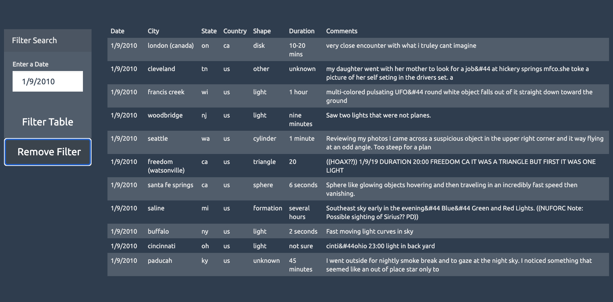
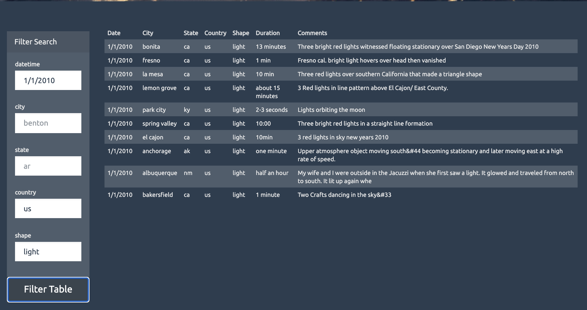
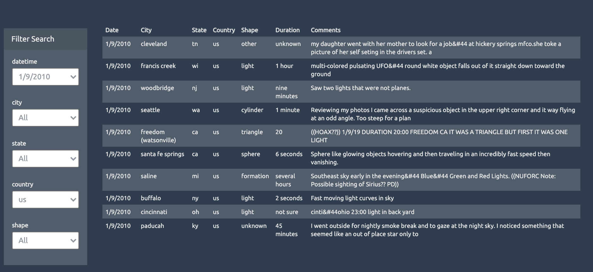

# javascript-challenge

Use D3.js JavaScript, HTML, and CSS, to filter table on web pages.

## Level 1

- <a href="https://simon-xu-lan.github.io/javascript-challenge/UFO-level-1/">Go to level 1 page</a>
- Filter the table by one field - Datetime
- Use one **input** to collect user input

## Level 2

- <a href="https://simon-xu-lan.github.io/javascript-challenge/UFO-level-2/">Go to level 2 page</a>
- Filter the table by mutilple fields
  - Datetime
  - City
  - State
  - Country
  - Shape
- Use five **input**s to collect user inputs

## Level 3

- <a href="https://simon-xu-lan.github.io/javascript-challenge/UFO-level-3/">Go to level 3 page</a>
- Filter the table by mutilple fields
  - Datetime
  - City
  - State
  - Country
  - Shape
- Use five **select**s to let user to choose options
- Once a select has been selected, all other select shall be updated with available options
- User can select "All" to remove filter for each field

## Lesson learned

- D3 js is designed from data to DOM, so it is easy to build elements from data. However it is not convient to manipulate DOM by D3.js
- Use vanilla js is good choice to manipute DOM if it can be easy done by D3.js
- Therefore, use D3.js to do data driven things. use other tools such as vanilla js, jQuery to other things.
